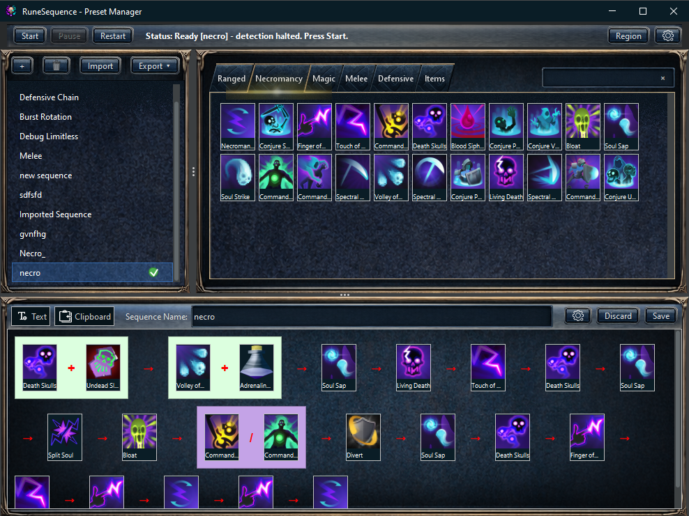

# RuneSequence: An Advanced Sequence Helper

RuneSequence is a desktop application designed to help users master complex ability rotations. It provides a real-time, on-screen overlay that guides you through your chosen sequence, helping you build muscle memory and execute your rotations with precision.

## Key Features

* **Intuitive On-Screen Overlay:** Get clear, real-time guidance on which ability to use next.
* **Custom Rotation Builder:** Create your own sequences with a simple, easy-to-use interface.
* **Import and Export Presets:** Share your favorite rotations with the community or import popular ones.
* **Smart Region Detection:** The app automatically detects where your abilities are on the screen.
* **Customizable Hotkeys:** Control the application without interrupting your gameplay.

## Screenshots
<table>
  <tr>
    <td align="center" width="50%">
      
       
      Overlay + sequence UI
    </td>
    <td align="center" width="50%">
      
       
      Region selection
    </td>
  </tr>
</table>

  

  
   
  Closeup view of ability detection

## Getting Started

1. **Download the Application:** Grab the latest `RuneSequence-<version>.zip` from the releases page.
2. **Extract and Run:**
   - Windows: run `RuneSequence.exe`
3. **Configure Your Setup:**
    * Use the "Select Region" option to draw a box around your in-game abilities.
    * Open the "Preset Manager" to create a new rotation or import an existing one.
    * Assign your preferred hotkeys in the settings.
4. **Start Playing:** Activate your chosen sequence and follow the on-screen prompts.

## Development Builds

Playtest builds are shipped as Gradle `distZip` distributions (they include a bundled Java runtime under `runtime/`,
created via `jlink`).

- Windows (PowerShell/CMD): `.\gradlew.bat clean test distZip`
- Linux/WSL: `./gradlew clean test distZip`

## Packaging (Windows)

Windows end-user builds are produced via `jpackage` and include a bundled Java runtime (users do not install Java
separately).

### Portable Zip

Creates a portable zip (no installer):

- Windows (PowerShell/CMD): `.\gradlew.bat clean jpackageZip`
- Output: `build/distributions/RuneSequence-<version>-windows.zip`
- End user: extract the zip and run `RuneSequence.exe` (keep the `app/` and `runtime/` folders next to the exe)

Troubleshooting:
- If ability detection fails to load OpenCV natives on a clean Windows VM, install the Microsoft Visual C++ Redistributable (x64) and restart RuneSequence.
